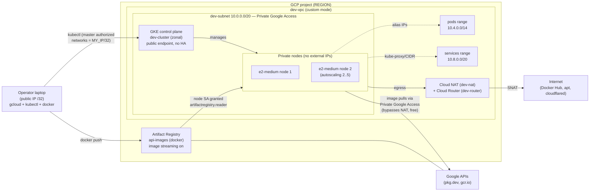
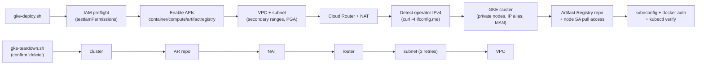

# gke-deploy.sh

Provisions a development GKE cluster on Google Cloud with network isolation, autoscaling, and an in-region Artifact Registry — in one idempotent script.

## What it creates

| Resource | Details |
| --- | --- |
| VPC + subnet | Dedicated custom-mode VPC (`dev-vpc`), subnet with Private Google Access and secondary ranges for pods/services |
| Cloud Router + NAT | Outbound internet for private nodes/pods (image pulls from Docker Hub, cloudflared, packages) |
| GKE cluster | Zonal `dev-cluster` (single managed control plane, no HA), private nodes, e2-medium, autoscaling 2→5, stable release channel |
| Control plane access | Public endpoint restricted to your current public IP (master authorized networks) |
| Artifact Registry | `api-images` Docker repo in the same region, image streaming enabled, node SA granted pull access |
| Local config | Docker push credentials + kubeconfig for the new cluster |

## Architecture



Script flow (deploy creates in order, teardown deletes in reverse dependency order):



An editable draw.io version of the infrastructure diagram is in [`gke-setup.drawio`](gke-setup.drawio) — open it at [app.diagrams.net](https://app.diagrams.net).

## Prerequisites

- `gcloud` CLI installed and authenticated:
  ```bash
  gcloud auth login
  gcloud auth application-default login   # optional, not strictly required
  ```
- `kubectl` installed
- `gke-gcloud-auth-plugin` installed — required for kubectl GKE auth (see Troubleshooting below):
  ```bash
  gcloud components install gke-gcloud-auth-plugin
  ```
- `curl` installed
- A GCP project with a billing account attached
- Your account needs permission to: enable APIs, create compute networks/routers, create GKE clusters, and manage Artifact Registry (e.g. `roles/owner` on a dev project, or a combination of `compute.admin`, `container.admin`, `artifactregistry.admin`, `serviceusage.admin`)

  This is verified automatically: before creating anything, the script runs an
  IAM preflight check (`resourcemanager.testIamPermissions`) that evaluates
  your *effective* permissions — including roles inherited from the org,
  folders, or group memberships — and fails with the exact missing permissions
  plus copy-pasteable `gcloud projects add-iam-policy-binding` grant commands.
  Skip the check with `IAM_CHECK=0` if your permissions come from a source it
  can't see.

## Usage

Minimal:

```bash
PROJECT_ID=my-project-id ./gke-deploy.sh
```

With overrides:

```bash
PROJECT_ID=my-project-id \
REGION=us-east1 \
ZONE=us-east1-b \
CLUSTER=loadtest-cluster \
MAX_NODES=8 \
./gke-deploy.sh
```

The script is idempotent: existing resources are detected and skipped, so it is safe to re-run (e.g. after a partial failure).

Runtime: cluster creation takes ~5–10 minutes; the whole script ~10 minutes.

## Configuration

All variables are optional except `PROJECT_ID`:

| Variable | Default | Description |
| --- | --- | --- |
| `PROJECT_ID` | *(required)* | GCP project ID |
| `REGION` | `us-central1` | Region for subnet, router, NAT, Artifact Registry |
| `ZONE` | `us-central1-a` | Cluster zone |
| `CLUSTER` | `dev-cluster` | Cluster name |
| `VPC` | `dev-vpc` | VPC network name |
| `SUBNET` | `dev-subnet` | Subnet name |
| `ROUTER` | `dev-router` | Cloud Router name |
| `NAT` | `dev-nat` | Cloud NAT name |
| `REPO` | `api-images` | Artifact Registry repository name |
| `MACHINE_TYPE` | `e2-medium` | Node machine type |
| `MIN_NODES` | `2` | Autoscaler minimum (also initial node count) |
| `MAX_NODES` | `5` | Autoscaler maximum |
| `IAM_CHECK` | `1` | Set to `0` to skip the IAM preflight permission check |

IP ranges are hardcoded near the top of the script (`SUBNET_RANGE`, `PODS_RANGE`, `SERVICES_RANGE`) — edit them there if they collide with an existing network.

## After deployment

Push and deploy an image:

```bash
docker tag my-api:v1 us-central1-docker.pkg.dev/PROJECT_ID/api-images/my-api:v1
docker push us-central1-docker.pkg.dev/PROJECT_ID/api-images/my-api:v1
```

```yaml
image: us-central1-docker.pkg.dev/PROJECT_ID/api-images/my-api:v1
```

Image pulls from Artifact Registry go over Private Google Access — they bypass Cloud NAT and incur no data-processing charges.

If your public IP changes, kubectl will stop working until you re-authorize it:

```bash
gcloud container clusters update dev-cluster --zone=us-central1-a \
  --enable-master-authorized-networks \
  --master-authorized-networks=NEW_IP/32
```

## Cost

Roughly **$0.40–0.90 per 4-hour session** in us-central1 (zonal cluster fee likely covered by the $74.40/month free-tier credit; 2× e2-medium nodes ~$0.27; NAT + disks + LB add cents). Always-on it is ~$50–70/month. Delete the cluster when not in use:

```bash
gcloud container clusters delete dev-cluster --zone=us-central1-a
```

## Teardown

Use the companion teardown script — it deletes everything in dependency order
(cluster → Artifact Registry → NAT → router → subnet → VPC), skips resources
that are already gone, and asks for confirmation first:

```bash
PROJECT_ID=my-project-id ./gke-teardown.sh
PROJECT_ID=my-project-id ./gke-teardown.sh --yes   # skip confirmation
```

It accepts the same env-var overrides as `gke-deploy.sh` (`REGION`, `ZONE`,
`CLUSTER`, `VPC`, `SUBNET`, `ROUTER`, `NAT`, `REPO`).

Manual equivalent, in order:

```bash
gcloud container clusters delete dev-cluster --zone=us-central1-a
gcloud artifacts repositories delete api-images --location=us-central1
gcloud compute routers nats delete dev-nat --router=dev-router --region=us-central1
gcloud compute routers delete dev-router --region=us-central1
gcloud compute networks subnets delete dev-subnet --region=us-central1
gcloud compute networks delete dev-vpc
```

## Troubleshooting

Issues hit during the first real deploy run (2026-09-26), why they happened, and why the fixes work. Full diffs in [`FIXES.md`](FIXES.md).

### `ERROR: could not detect public IP` on a dual-stack network

`ifconfig.me` echoes back the source IP of the connection. On a network with both IPv4 and IPv6, curl may connect over IPv6 (AAAA records win by default), so the service echoes an IPv6 address — which fails the script's IPv4 validation. The script now forces IPv4 with `curl -4`. IPv4 matters because the result feeds `--master-authorized-networks="$MY_IP/32"`, and consumer IPv6 prefixes rotate frequently (privacy extensions), so pinning an IPv6 address would quickly lock you out; an IPv4 /32 is the stable, intended behavior.

### `Cannot specify --cluster-secondary-range-name without --enable-ip-alias`

GKE VPC-native clusters assign pod and service IPs from the subnet's *secondary ranges* (the `pods` and `services` ranges created in step 1) using alias IP ranges on the node NICs. `--cluster-secondary-range-name=pods` tells GKE *which* named secondary range to use — a concept that only exists when alias IPs are on. gcloud requires that to be opted into explicitly, so it rejects the secondary-range flags as meaningless without `--enable-ip-alias` rather than silently ignoring them. The script now passes `--enable-ip-alias`.

### `unrecognized arguments: --enable-image-streaming`

Image streaming used to be an opt-in beta feature enabled per-repo with that flag. Google made it the default for all Artifact Registry Docker repos in supported regions and removed the opt-in from the GA gcloud surface. Dropping the flag loses nothing: streaming is automatically active, so GKE can begin running containers while the image is still downloading, and those pulls go over Google's network rather than Cloud NAT (no NAT charges).

### `CRITICAL: ACTION REQUIRED: gke-gcloud-auth-plugin ... was not found`

Since kubectl v1.26, GKE cluster auth no longer uses the old embedded gcloud token mechanism. The kubeconfig that `gcloud container clusters get-credentials` generates contains an `exec` stanza that literally runs the `gke-gcloud-auth-plugin` binary to fetch a short-lived token on every API call. If that binary isn't on your PATH, kubectl can't authenticate at all — the cluster is healthy but every kubectl call fails. Fix (one-time, local machine):

```bash
gcloud components install gke-gcloud-auth-plugin --quiet
```

## Not included

Deploy-time work that runs against the cluster after provisioning (install separately):

- GKE ingress/gateway for publicly exposed APIs
- `cloudflared` Deployment + Cloudflare Tunnel/Access for admin tools (ArgoCD, Grafana, OpenObserve)
- cert-manager / TLS
- The tools themselves (ArgoCD, Grafana, OpenObserve, Headlamp)
